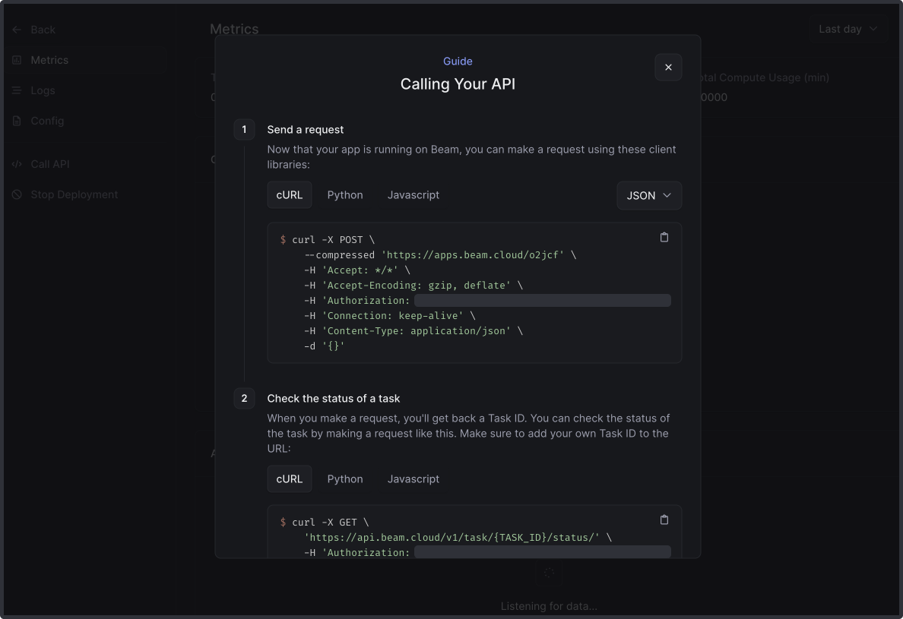

# Alpaca LoRA Training and Inference on Beam

This example demonstrates how to fine-tune and deploy [Alpaca-LoRA](https://github.com/tloen/alpaca-lora) on [Beam](https://beam.cloud).

To run this example, you'll need a free account on Beam. If you [signup here](htt[s://beam.cloud]), you'll get 10 hours of free credit to get started.

## Speedrun

If you'd like to run this example immediately, start by cloning this repo.

#### Train

Start a fine-tuning job:

```sh
beam run app.py:train_model
```

#### Inference

> You must train the model before you can run inference. 

Run a single inference:

```sh
 beam run app.py:run_inference \
 -d '{"input": "what are the five steps to become a published author?"}'
```

#### Deploy

Deploy a REST API to run inference externally:

```sh
beam deploy app.py:run_inference
```

## Tutorial

### Training

We're going to implement the code in the [Alpaca LoRA repo](https://github.com/tloen/alpaca-lora) in a script we can run on Beam.

I'm using the [Instruction Tuning with GPT-4](https://github.com/Instruction-Tuning-with-GPT-4/GPT-4-LLM) dataset, which is hosted on Huggingface.

The first thing we'll do is setup the compute environment to run our LLM. The training script is run on a 24Gi A10G GPU:

> This example only demonstrates the high-level workflow, so specific functions like `train` are hidden. You can find the entire source code in this repo.  

```python
from math import ceil

from beam import App, Runtime, Image, Volume
from datasets import load_dataset

# ------------------------------------------------- #
#                   Beam App                        #
# ------------------------------------------------- #
app = App(
    "fine-tune-llama",
    runtime=Runtime(
        cpu=4,
        memory="32Gi",
        gpu="A10G",
        image=Image(
            python_version="python3.10",
            python_packages="requirements.txt",
        ),
    ),
    volumes=[
        # checkpoints is used to save fine-tuned models
        Volume(name="checkpoints", path="./checkpoints"),
        # pretrained-models is used to cache model weights
        Volume(name="pretrained-models", path="./pretrained-models"),
    ],
)


# ------------------------------------------------- #
#                   Training API                    #
# ------------------------------------------------- #
@app.run()
def train_model():
    # Trained models will be saved to this path
    beam_volume_path = "./checkpoints"

    # We use the vicgalle/alpaca-gpt4 dataset hosted on Huggingface:
    # https://huggingface.co/datasets/vicgalle/alpaca-gpt4
    dataset = load_dataset("vicgalle/alpaca-gpt4")

    # Adjust the training loop based on the size of the dataset
    samples = len(dataset["train"])
    val_set_size = ceil(0.1 * samples)

    train(
        base_model=base_model,
        val_set_size=val_set_size,
        data=dataset,
        output_dir=beam_volume_path,
    )
```

In order to run this on Beam, we use the `beam run` command:

```sh
beam run app.py:train_model
```

When we run this command, the training function will run on Beam's cloud, and we'll see the progress of the training process streamed to our terminal:


# Deploying Inference API

When the model is trained, we can deploy an API to run inference on our fine-tuned model.

Let's create a new function for inference. If you look closely, you'll notice that we're using a different decorator this time: `rest_api` instead of `run`.

This will allow us to deploy the function as a REST API.

```python
# ------------------------------------------------- #
#                  Inference API                    #
# ------------------------------------------------- #
@app.rest_api()
def run_inference(**inputs):
    # Inputs passed to the API
    input = inputs["input"]

    # Grab the latest checkpoint
    checkpoint = get_newest_checkpoint()

    # Initialize models
    models = load_models(checkpoint=checkpoint)

    model = models["model"]
    tokenizer = models["tokenizer"]
    prompter = models["prompter"]

    # Generate text
    response = call_model(
        input=input, model=model, tokenizer=tokenizer, prompter=prompter
    )
    return response
```

We can deploy this as a REST API by running this command:

```sh
beam deploy app.py:run_inference
```


If we navigate to the URL printed in the shell, we'll be able to copy the full cURL request to call the REST API.



I modified the request slightly with a payload for the model:

```sh
-d '{"input": "what are the five steps to become a published author?"}'
```

And here's the response from the fine-tuned model:

```sh
1. Write a book
2. Get an agent
3. Get a publisher
4. Get a book deal
5. Get a book published
```
